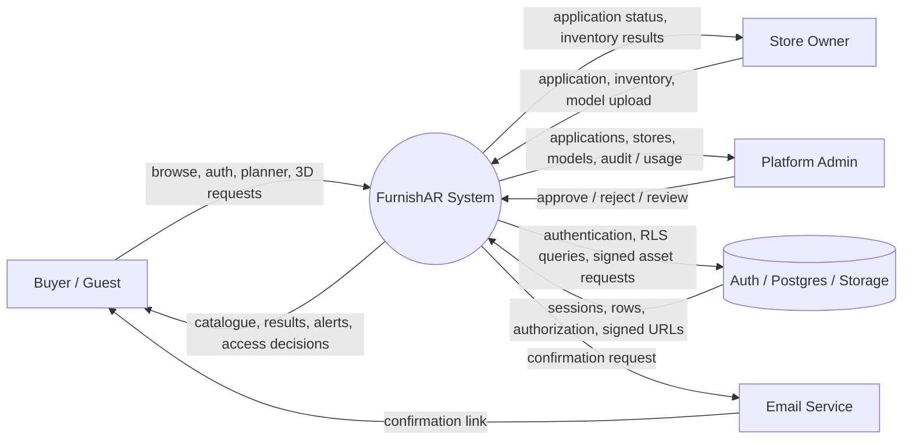
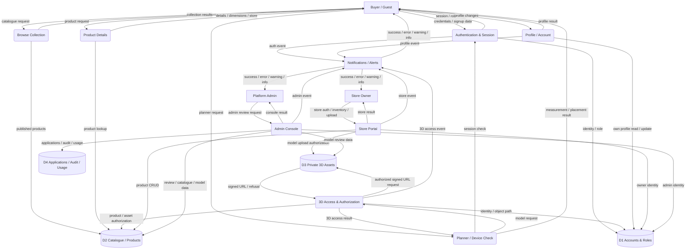

# FurnishAR DFD v2

This is the implementation-aligned replacement for the supplied sample DFD.

## Key corrections from the sample

- Separate **Buyer**, **Store Owner**, and **Platform Admin** paths instead of routing all roles through one generic homepage.
- Replace generic `success` decisions with explicit process outcomes.
- Treat **authentication**, **authorization**, and **device capability** as different processes.
- Replace the sample's `Discover` destination with the real repository route `/collection`.
- Keep `/furniture/[slug]`, `/plan`, `/account`, `/portal`, and `/admin` as distinct application surfaces.
- Add explicit data stores for accounts/roles, catalogue/products, 3D assets, and applications/audit/usage.
- Make the protected 3D model boundary explicit.
- Add explicit failure/denied/session-expired paths.
- Label every connector with the data or event being transferred.
- Keep connectors local so lines do not cross through unrelated endpoints or terminate in empty space.

## Actual application surfaces

| Surface | Route | DFD process |
|---|---|---|
| Home | `/` | Public entry |
| Collection / discovery | `/collection` | P2 Browse Collection |
| Product details | `/furniture/[slug]` | P3 Product Details |
| Buyer authentication | `/login?as=buyer` | P1 Authentication |
| Buyer account | `/account` | P6 Profile / Account |
| Space planner | `/plan` | P4 Planner / Device Check |
| Store portal | `/portal` | P7 Store Portal |
| Platform console | `/admin` | P8 Admin Console |

## Actual API boundary

The DFD is aligned with the current repository routes:

- `POST /api/sb/auth/login`
- `POST /api/sb/auth/signup`
- `POST /api/sb/auth/refresh`
- `POST /api/sb/auth/logout`
- `POST /api/sb/auth/resend`
- `GET /api/sb/status`
- `GET|HEAD|POST|PATCH|DELETE /api/sb/rest/<allowlisted-resource>`
- `GET /api/sb/model/<store-id>/<product-id>/<file>`
- `POST /api/sb/storage/sign`
- demo/fallback `GET /api/products`
- demo/fallback `GET /api/stores`
- demo/fallback `POST /api/auth/login`

There is no standalone `/discover` route in the current repository. Discovery is represented by the collection/catalogue process.

## Level 0 context DFD



## Level 1 system DFD



## Critical 3D access flow

```mermaid
flowchart LR
    U[Guest / Buyer]
    P[Product Page\n/furniture/[slug]]
    G{Protected action?}
    L[Authentication Gate\n/login?as=buyer&next=...]
    S[Session Check\nmy_role()]
    R[Planner\n/plan]
    M[GET /api/sb/model/<path>]
    Z[Authorization\ncan_view_model / Storage RLS]
    A[(Private 3D Asset)]
    V[Signed URL\n5 minutes]
    N[Alert System]

    U --> P
    P --> G
    G -->|guest| L
    G -->|signed in| S
    L -->|success| S
    L -->|failure| N
    S -->|authenticated| R
    S -->|expired / invalid| N
    R --> M
    M --> Z
    Z -->|allowed| A
    A --> V
    V --> M
    M -->|200 signed URL| R
    Z -->|denied| N
    M -->|401 / 403 / 5xx / network| N
    R -->|3D / AR result| U
    N -->|human-readable alert| U
```

## Process definitions

### P1 Authentication & Session
Handles buyer login/signup, store-owner login, admin sign-in, refresh, logout, and role resolution.

### P2 Browse Collection
Public catalogue browsing through `/` and `/collection`.

### P3 Product Details
Public furniture information. The product page does not directly expose the protected 3D file.

### P4 Planner / Device Check
`/plan`, camera/device checks, room measurement, furniture placement, WebXR/Quick Look, and fallback behavior.

### P5 3D Access & Authorization
Protected model boundary. Authentication asks who the caller is; authorization asks whether that caller may access the requested object.

### P6 Profile / Account
`/account`. Buyer-owned profile operations only.

### P7 Store Portal
`/portal`. Store application, owner authentication, inventory, product CRUD, and model upload.

### P8 Admin Console
`/admin`. Platform-level application review, stores, models, usage, and audit activity.

### P9 Notifications / Alerts
Centralized user feedback. Alerts represent actual events and do not replace the underlying operation.

## Reliability rules for the diagram

1. Every connector has a real source and destination.
2. Every connector terminates on a node boundary.
3. No connector passes through an unrelated node.
4. No generic `success` node is reused for unrelated operations.
5. Authentication and authorization are separate.
6. A route is not automatically a data store.
7. A device check is not an authentication decision.
8. Failure paths are shown when they change the next system state.
9. Protected 3D assets are never represented as public static files in the database-backed path.
10. The DFD follows the current repository instead of inventing a future route.

## DFD artifact

The companion `FURNISHAR-DFD-V2.drawio` contains a clean implementation-oriented diagram with the main nodes separated so connector endpoints meet their intended processes instead of converging on arbitrary page boxes.
