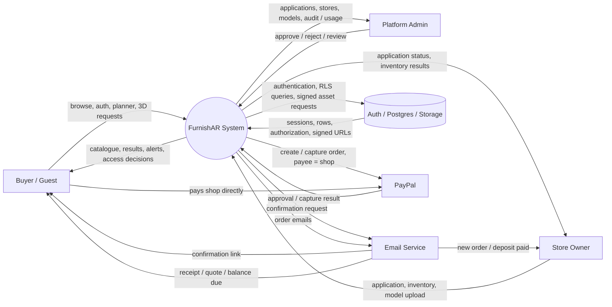
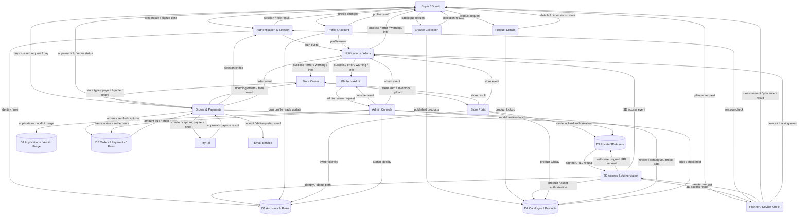
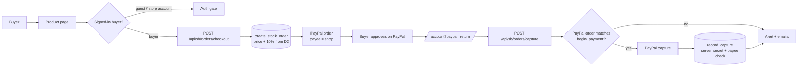

# FurnishAR DFD v2

This is the implementation-aligned replacement for the supplied sample DFD.

## Key corrections from the sample

- Separate **Buyer**, **Store Owner**, and **Platform Admin** paths instead of routing all roles through one generic homepage.
- Replace generic `success` decisions with explicit process outcomes.
- Treat **authentication**, **authorization**, and **device capability** as different processes.
- Replace the sample's `Discover` destination with the real repository route `/collection`.
- Keep `/furniture/[slug]`, `/plan`, `/account`, `/portal`, and `/admin` as distinct application surfaces.
- Add explicit data stores for accounts/roles, catalogue/products, 3D assets, and applications/audit/usage.
- Make the protected 3D model boundary explicit.
- Add explicit failure/denied/session-expired paths.
- Label every connector with the data or event being transferred.
- Keep connectors local so lines do not cross through unrelated endpoints or terminate in empty space.

## Actual application surfaces

| Surface | Route | DFD process |
|---|---|---|
| Home | `/` | Public entry |
| Collection / discovery | `/collection` | P2 Browse Collection |
| Product details | `/furniture/[slug]` | P3 Product Details |
| Buyer authentication | `/login?as=buyer` | P1 Authentication |
| Buyer account | `/account` | P6 Profile / Account |
| Space planner | `/plan` | P4 Planner / Device Check |
| Store portal | `/portal` | P7 Store Portal |
| Platform console | `/admin`, `/admin/applications`, `/admin/stores`, `/admin/models`, `/admin/usage`, `/admin/activity` | P8 Admin Console |
| Store owner / admin sign-in | `/login` (role resolved by `my_role()` after sign-in, not by the URL), the `/admin` gate | P1 Authentication |
| Device check | `/diagnose` | P4 Planner / Device Check (read-only capability report; no data store) |
| Help | `/faq` | Public content — no process, no data flow |
| Buy / request a build | `/furniture/[slug]` (purchase panel) | P10 Orders & Payments |
| Buyer orders, PayPal return | `/account#orders`, `/account?paypal=return` | P10 Orders & Payments |
| Receipt | `/account/receipt/[id]` | P10 Orders & Payments (read, per RLS) |
| Store billing and incoming orders | `/portal#orders` | P7 → P10 |
| Platform fees | `/admin/billing` | P8 → D5 |

## Actual API boundary

The DFD is aligned with the current repository routes:

- `POST /api/sb/auth/login`
- `POST /api/sb/auth/signup`
- `POST /api/sb/auth/refresh`
- `POST /api/sb/auth/logout`
- `POST /api/sb/auth/resend`
- `GET /api/sb/status`
- `GET|HEAD|POST|PATCH|DELETE /api/sb/rest/<allowlisted-resource>`
- `GET /api/sb/model/<store-id>/<product-id>/<file>`
- `POST /api/sb/storage/sign`
- demo/fallback `GET /api/health`
- demo/fallback `GET /api/products`
- demo/fallback `GET /api/stores`
- demo-only `POST /api/auth/login`, `POST|PUT|DELETE /api/products[/<id>]` — **404 on any deployment with a database**
- demo-only `GET /api/demo-model/<name>.glb` — **404 on any deployment with a database**

### Endpoint → process

| Endpoint | Process | Data store |
|---|---|---|
| `/api/sb/auth/*` | P1 Authentication & Session | D1 (GoTrue) |
| `/api/sb/rest/rpc/my_role` | P1 role resolution | D1 |
| `/api/sb/rest/products`, `/api/sb/rest/catalog`, `/api/sb/rest/stores` | P2 / P3 reads, P7 writes | D2 |
| `/api/sb/rest/buyers`, `/api/sb/rest/municipalities` | P6 Buyer Account (and P1 sign-up form) | D1 |
| `/api/sb/rest/store_applications` | P7 apply, P8 review | D4 |
| `/api/sb/rest/rpc/approve_store_application`, `reject_store_application`, `applicant_account`, `storage_usage`; `/api/sb/rest/admin_audit`, `platform_admins` | P8 Admin Console | D1, D4 |
| `/api/sb/model/<store>/<product>/<file>` | P5 3D Access & Authorization | D3 |
| `/api/sb/storage/sign` | P7 Store model upload | D3 |
| `/api/sb/status` | Health (no process data) | — |
| `GET /api/sb/orders/config` | P10 — are payments / emails switched on (no secrets) | — |
| `POST /api/sb/orders/checkout`, `pay`, `capture`, `request`, `cancel` | P10 Orders & Payments (buyer) | D2, D5, PayPal |
| `POST /api/sb/orders/quote`, `decline`, `ready`, `fulfil`, `delivery`, `store-billing` | P10 Orders & Payments (store owner) | D5 |
| `/api/sb/rest/orders`, `payments`, `store_payout`, `fee_settlements` (read-only) | P10 reads, per RLS | D5 |
| `/api/sb/rest/rpc/store_fee_summary`, `fee_overview`, `record_fee_settlement` | P7 fee balance, P8 settlement | D5, D4 (audit) |

The demo endpoints are the database-less mode only: no accounts exist there, so
there is nothing to authenticate or authorize. With a database configured they
refuse, so P1 is the only way to sign in and P5 is the only way to a model.

There is no standalone `/discover` route in the current repository. Discovery is represented by the collection/catalogue process.

## Level 0 context DFD



## Level 1 system DFD



## Critical 3D access flow

```mermaid
flowchart LR
    U[Guest / Buyer]
    P[Product Page\n/furniture/[slug]]
    G{Protected action?}
    L[Authentication Gate\n/login?as=buyer&next=...]
    S[Session Check\nmy_role()]
    R[Planner\n/plan]
    M[GET /api/sb/model/<path>]
    Z[Authorization\ncan_view_model / Storage RLS]
    A[(Private 3D Asset)]
    V[Signed URL\n5 minutes]
    N[Alert System]

    U --> P
    P --> G
    G -->|guest| L
    G -->|signed in| S
    L -->|success| S
    L -->|failure| N
    S -->|authenticated| R
    S -->|expired / invalid| N
    R --> M
    M --> Z
    Z -->|allowed| A
    A --> V
    V --> M
    M -->|200 signed URL| R
    Z -->|denied| N
    M -->|401 / 403 / 5xx / network| N
    R -->|3D / AR result| U
    N -->|human-readable alert| U
```

## Payment flow (P10)



Custom builds follow the same capture path in stages: `requested → quoted →
deposit (50%) → deposit_paid → ready → balance → paid → fulfilled`.

## Process definitions

### P1 Authentication & Session
Handles buyer login/signup, store-owner login, admin sign-in, refresh, logout, and role resolution.

### P2 Browse Collection
Public catalogue browsing through `/` and `/collection`.

### P3 Product Details
Public furniture information. The product page does not directly expose the protected 3D file.

### P4 Planner / Device Check
`/plan`, camera/device checks, room measurement, furniture placement, WebXR/Quick Look, and fallback behavior.

### P5 3D Access & Authorization
Protected model boundary. Authentication asks who the caller is; authorization asks whether that caller may access the requested object.

### P6 Profile / Account
`/account`. Buyer-owned profile operations only.

### P7 Store Portal
`/portal`. Store application, owner authentication, inventory, product CRUD, and model upload.

### P8 Admin Console
`/admin`. Platform-level application review, stores, models, usage, and audit activity.

### P9 Notifications / Alerts
Centralized user feedback. Alerts represent actual events and do not replace the underlying operation.

### P10 Orders & Payments
Buying from a **stocked** shop (pay in full, stock held 30 minutes) and custom
builds from a **custom** shop (request → quote → 50% deposit → balance).
Buyers pay the shop's own PayPal account; the buyer pays the shop price plus a
10% FurnishAR service fee, which accrues per payment in D5 and is settled by
the shop to FurnishAR (recorded in P8). Authentication is the session check;
authorization is the 0009 functions, run as the caller: only a shopper account
orders, only a store's members quote or mark its orders, only the buyer pays
their own order. Amounts come from the database, never the browser; a payment
is recorded only after the server has captured it with PayPal and checked the
amount and payee, and only with the server's payment-recorder secret. Emails
(Resend) are notifications of recorded events and never block them.

## Reliability rules for the diagram

1. Every connector has a real source and destination.
2. Every connector terminates on a node boundary.
3. No connector passes through an unrelated node.
4. No generic `success` node is reused for unrelated operations.
5. Authentication and authorization are separate.
6. A route is not automatically a data store.
7. A device check is not an authentication decision.
8. Failure paths are shown when they change the next system state.
9. Protected 3D assets are never represented as public static files in the database-backed path.
10. The DFD follows the current repository instead of inventing a future route.

## Implementation reconciliation — 2026-09-23

Where this DFD and the code disagreed, and which one moved.

**1. Demo sign-in on a database deployment**
- DFD ISSUE: the API list marks `POST /api/auth/login` as demo/fallback, but did not say when it may answer.
- CURRENT CODE BEHAVIOR (before): it answered on every deployment, issuing an owner token for a password published in `lib/handler.js`; the demo inventory writes answered too. That is a second P1 beside `/api/sb/auth/*`.
- RECOMMENDED ARCHITECTURE: one authentication process. Demo sign-in and writes answer only when no database is configured, like `/api/demo-model`.
- REASON: authentication must have one owner; a fallback must never widen access. **Code changed** (`lib/handler.js`, test in `tests/api.test.js`).

**2. Authorization-denied wording**
- DFD ISSUE: none — the flow says "authz fail → denied, no asset".
- CURRENT CODE BEHAVIOR (before): the planner and product viewer overrode the denial with "3D preview is unavailable for this account.", which does not say it was a permission decision.
- RECOMMENDED ARCHITECTURE: P5 denial → P9 raises "You don't have permission to view this 3D model."
- REASON: a denial should read as a denial. A missing object still answers the same `403 unavailable` on purpose (it must not reveal what a store is drafting), so the wording is the same for both. **Code changed.**

**3. Tracking loss was not an event**
- DFD ISSUE: P4 had no flow to P9, so device/tracking failures had nowhere to go.
- CURRENT CODE BEHAVIOR (before): losing tracking changed an on-screen label and, in scan mode only, a hint.
- RECOMMENDED ARCHITECTURE: P4 → P9 "device / tracking event": one alert per loss ("Tracking lost. Move your phone slowly."), withdrawn when tracking returns. Not raised for the first pose-less frames of a session, which are "acquiring".
- REASON: alerts represent real events; a frozen reading with no explanation is a silent failure. **DFD and code changed** (edge `e40` in the drawio).

**4. Credentials and sign-up wording**
- CURRENT CODE BEHAVIOR (before): "That email and password do not match an account." / "Your account has been created successfully."
- RECOMMENDED ARCHITECTURE: P1 → P9 "Invalid email or password." / "Account created successfully." — neither says which half was wrong.
- REASON: one catalogue of messages, matching the specification. **Code changed.**

**5. Routes the DFD did not name**
- DFD ISSUE: `/api/demo-model`, `/api/health`, `/diagnose`, `/faq` and the admin sub-routes were absent.
- CURRENT CODE BEHAVIOR: all exist and are correct.
- RECOMMENDED ARCHITECTURE: listed above against their process. `/faq` is content, not a process; `/diagnose` reports device capability and touches no store.
- REASON: every endpoint maps to a process. **DFD changed.**

**6. Orders and payments (added 2026-09-23)**
- DFD ISSUE: the DFD had no ordering or payment process; FurnishAR did not take orders.
- CURRENT CODE BEHAVIOR (before): browse and plan only.
- RECOMMENDED ARCHITECTURE: P10 Orders & Payments, D5 Orders / Payments / Fees, PayPal and Email as external entities, endpoints `/api/sb/orders/*` as listed above.
- REASON: requested feature. Added to the DFD and the code together. Also closed a hole found on the way: store owners could UPDATE every column of their store (including `plan` and `status`); 0009 limits them to the shop's own details.

**7. Delivery, pickup and receipts (added 2026-09-24)**
- DFD ISSUE: P10 ended at "paid"; nothing described how the buyer receives the piece or what record they keep.
- CURRENT CODE BEHAVIOR (before): no delivery details, no arrival date, a one-line "payment received" email.
- RECOMMENDED ARCHITECTURE: the buyer's delivery choice travels with the order into D5 (0010); the database stamps the estimated arrival on payment; the shop's delivery steps go through `POST /api/sb/orders/delivery` (P7 → P10 → D5) and each raises an email (P10 → Email Service → Buyer). The receipt is a read of D5 under RLS.
- REASON: requested feature. The Email Service entity is now Gmail (App Password) or Resend — both server-side only.

**8. Database state**
- Migrations 0005 (bucket limit), 0006 (buyers, `my_role`) and 0007 (private `furniture-models` bucket, `can_view_model` policy) are applied to the live project. 0008 takes trigger functions off the RPC surface and stops anonymous calls to `can_view_model`.

## DFD artifact

The companion `FURNISHAR-DFD-V2.drawio` contains a clean implementation-oriented diagram with the main nodes separated so connector endpoints meet their intended processes instead of converging on arbitrary page boxes.
