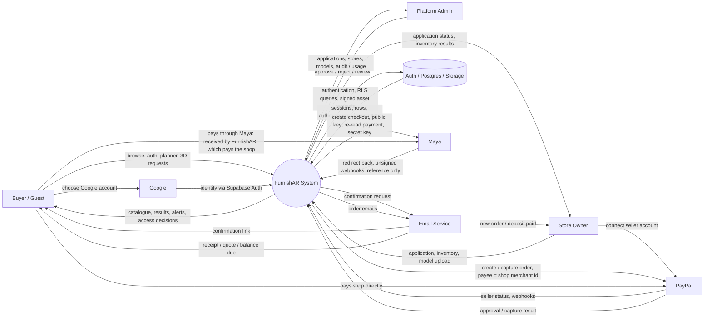
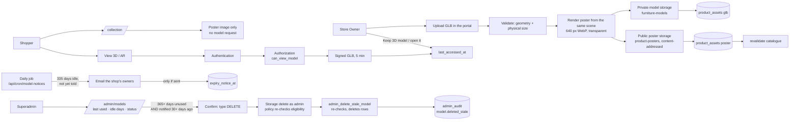
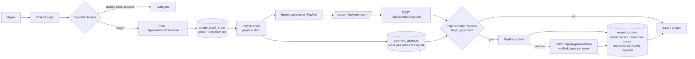
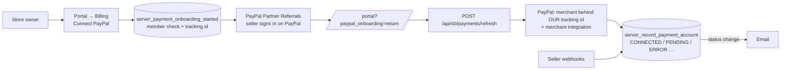
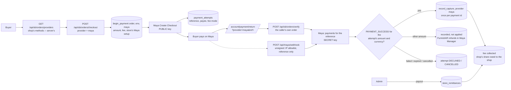
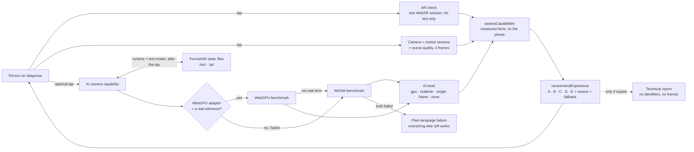

# FurnishAR DFD v2

This is the implementation-aligned replacement for the supplied sample DFD.

## Key corrections from the sample

- Separate **Buyer**, **Store Owner**, and **Platform Admin** paths instead of routing all roles through one generic homepage.
- Replace generic `success` decisions with explicit process outcomes.
- Treat **authentication**, **authorization**, and **device capability** as different processes.
- Replace the sample's `Discover` destination with the real repository route `/collection`.
- Keep `/furniture/[slug]`, `/plan`, `/account`, `/portal`, and `/admin` as distinct application surfaces.
- Add explicit data stores for accounts/roles, catalogue/products, 3D assets, and applications/audit/usage.
- Make the protected 3D model boundary explicit.
- Add explicit failure/denied/session-expired paths.
- Label every connector with the data or event being transferred.
- Keep connectors local so lines do not cross through unrelated endpoints or terminate in empty space.

## Actual application surfaces

| Surface | Route | DFD process |
|---|---|---|
| Home | `/` | Public entry |
| Collection / discovery | `/collection` | P2 Browse Collection |
| Product details | `/furniture/[slug]` | P3 Product Details |
| Buyer authentication | `/login?as=buyer` | P1 Authentication |
| Buyer account | `/account` | P6 Profile / Account |
| Space planner | `/plan` | P4 Planner / Device Check |
| Store portal | `/portal` | P7 Store Portal |
| Platform console | `/admin`, `/admin/applications`, `/admin/stores`, `/admin/models`, `/admin/usage`, `/admin/activity` | P8 Admin Console |
| Store owner / admin sign-in | `/login` (role resolved by `my_role()` after sign-in, not by the URL), the `/admin` gate | P1 Authentication |
| Device check | `/diagnose` | P4 Planner / Device Check (read-only capability report and one recommended mode A–E; no data store). The optional AI check downloads the ONNX runtime (`/ort/`) and a test model (`/ai/`), FurnishAR's own static files, only after a tap. |
| Help | `/faq` | Public content — no process, no data flow |
| Buy / request a build | `/furniture/[slug]` (purchase panel) | P10 Orders & Payments |
| Buyer orders, PayPal return | `/account#orders`, `/account?paypal=return` | P10 Orders & Payments |
| Payment return, provider-neutral (Maya, 0015) | `/account/payment/return?provider=maya&ref=…` | P10 10.16 Verify Maya Payment |
| Receipt | `/account/receipt/[id]` | P10 Orders & Payments (read, per RLS) |
| Store billing and incoming orders | `/portal#orders` | P7 → P10 |
| Platform fees, fee mode, PayPal and Maya status per shop, Maya setup, payouts to shops | `/admin/billing` | P8 → D5 (10.17) |
| Google sign-in return | `/auth/callback` | P1 Authentication (code → session) |
| First sign-in: choose buyer or store | `/onboarding` | P1 → P6 (buyer) / P7 (application) |
| Shop's PayPal seller connection | `/portal#billing` (Connect PayPal) | P7 → P10 → PayPal |

## Actual API boundary

The DFD is aligned with the current repository routes:

- `POST /api/sb/auth/login`
- `POST /api/sb/auth/signup`
- `POST /api/sb/auth/refresh`
- `POST /api/sb/auth/logout`
- `POST /api/sb/auth/resend`
- `GET /api/sb/auth/google`, `POST /api/sb/auth/exchange` (Google sign-in, PKCE)
- `GET /api/sb/account/state`, `POST /api/sb/account/buyer|apply` (onboarding)
- `POST /api/sb/payments/connect|refresh`, `GET /api/sb/payments/admin` (PayPal seller connection)
- `POST /api/paypal/webhook` (PayPal → P10)
- `POST /api/maya/webhook` (Maya → P10; unsigned, so each delivery is re-read from Maya — 0015)
- `GET /api/sb/orders/providers?store=<id>` (P10 10.14: the payment methods a shop takes)
- `GET /api/cron/payment-reminders` (scheduler → P10 → Email)
- `GET /api/cron/model-notices` (scheduler → P8 → Email: models 30 days from deletable, 0013)
- `GET /api/sb/status`
- `GET|HEAD|POST|PATCH|DELETE /api/sb/rest/<allowlisted-resource>`
- `GET /api/sb/model/<store-id>/<product-id>/<file>` (also records the model's last use, 0012)
- `POST /api/sb/storage/sign` (models into the private bucket; catalogue posters into the public one)
- `POST /api/sb/models/poster|revalidate|admin-cleanup` (catalogue posters, catalogue refresh, 365-day model cleanup — 0012)
- demo/fallback `GET /api/health`
- demo/fallback `GET /api/products`
- demo/fallback `GET /api/stores`
- demo-only `POST /api/auth/login`, `POST|PUT|DELETE /api/products[/<id>]` — **404 on any deployment with a database**

### Endpoint → process

| Endpoint | Process | Data store |
|---|---|---|
| `/api/sb/auth/*` | P1 Authentication & Session | D1 (GoTrue) |
| `/api/sb/rest/rpc/my_role` | P1 role resolution | D1 |
| `/api/sb/rest/products`, `/api/sb/rest/catalog`, `/api/sb/rest/stores` | P2 / P3 reads, P7 writes | D2 |
| `/api/sb/rest/buyers`, `/api/sb/rest/municipalities` | P6 Buyer Account (and P1 sign-up form) | D1 |
| `/api/sb/rest/store_applications` | P7 apply, P8 review | D4 |
| `/api/sb/rest/rpc/approve_store_application`, `reject_store_application`, `applicant_account`, `storage_usage`; `/api/sb/rest/admin_audit`, `platform_admins` | P8 Admin Console | D1, D4 |
| `/api/sb/model/<store>/<product>/<file>` | P5 3D Access & Authorization; records last use (5.5) | D3, D2 (`product_assets.last_accessed_at`) |
| `/api/sb/storage/sign` | P7 Store model and poster upload | D3, D6 |
| `POST /api/sb/models/poster` | P7 link the catalogue poster rendered from the model | D2, D6 |
| `POST /api/sb/models/revalidate` | P7 / P8 refresh the cached catalogue after a change | — |
| `POST /api/sb/models/admin-cleanup`; `/api/sb/rest/rpc/admin_model_lifecycle` | P8 model lifecycle and 365-day cleanup | D2, D3, D6, D4 (audit) |
| `GET /api/cron/model-notices` | P8 8.3 Notify Owner → Email Service (server secret; marks `expiry_notice_at` only when sent) | D2 (`product_assets`), D1 (owner emails) |
| `/api/sb/rest/rpc/store_model_lifecycle`, `keep_model` | P7 the shop's own model lifecycle; "Keep 3D model" records a use | D2 |
| `/api/sb/status` | Health (no process data) | — |
| `GET /api/sb/orders/config` | P10 — are payments / emails switched on (no secrets) | — |
| `POST /api/sb/orders/checkout`, `pay`, `capture`, `verify`, `request`, `cancel` | P10 Orders & Payments (buyer); `checkout` / `pay` take `provider` = `paypal` \| `maya`; `verify` is the Maya return (10.16) | D2, D5, PayPal, Maya |
| `GET /api/sb/orders/providers?store=<id>` | P10 10.14 Offer Payment Methods (public; provider ids only) | D5 (`store_payment_providers`) |
| `POST /api/maya/webhook` | P10 10.16 — reference only; payment re-read with the secret key; once per (payment, status) | D5 (`payment_webhook_events`, `payments`, `payment_attempts`) |
| `/api/sb/rest/rpc/admin_set_maya_account`, `record_store_remittance`; `/api/sb/rest/store_remittances` (read-only) | P8 10.17 Maya setup and payouts (admin only; audited) | D5 (`store_payment_accounts`, `store_remittances`), D4 (audit) |
| `POST /api/sb/orders/quote`, `decline`, `ready`, `fulfil`, `delivery`, `store-billing` | P10 Orders & Payments (store owner) | D5 |
| `/api/sb/rest/orders`, `payments`, `store_payout`, `fee_settlements` (read-only) | P10 reads, per RLS | D5 |
| `/api/sb/rest/rpc/store_fee_summary`, `fee_overview`, `record_fee_settlement` | P7 fee balance, P8 settlement | D5, D4 (audit) |
| `GET /api/sb/auth/google`, `POST /api/sb/auth/exchange` | P1 Google sign-in (identity only; provider tokens dropped) | D1 (GoTrue), Google |
| `/api/sb/account/state`, `buyer`, `apply` | P1 → P6 buyer onboarding / P7 store application | D1, D4 |
| `POST /api/sb/payments/connect`, `refresh`; `GET /api/sb/payments/admin` | P7 → P10 seller onboarding; P8 configuration | D5 (`store_payment_accounts`), PayPal |
| `POST /api/paypal/webhook` | P10 — verified, idempotent capture / refund / seller events | D5 (`payment_webhook_events`, `payments`, `payment_refunds`) |
| `GET /api/cron/payment-reminders` | P10 → Email Service, cooldown in D5 | D5 |
| `/api/sb/rest/store_payment_accounts`, `payment_attempts`, `payment_refunds`, `payment_webhook_events` (read-only) | P7 / P8 / P10 reads, per RLS | D5 |

The demo endpoints are the database-less mode only: no accounts exist there, so
there is nothing to authenticate or authorize. With a database configured they
refuse, so P1 is the only way to sign in and P5 is the only way to a model.

There is no standalone `/discover` route in the current repository. Discovery is represented by the collection/catalogue process.

## Level 0 context DFD



## Level 1 system DFD

```mermaid
flowchart TB
    B[Buyer / Guest]
    O[Store Owner]
    A[Platform Admin]

    P1(Authentication & Session)
    P2(Browse Collection)
    P3(Product Details)
    P4(Planner / Device Check)
    P5(3D Access & Authorization)
    P6(Profile / Account)
    P7(Store Portal)
    P8(Admin Console)
    P9(Notifications / Alerts)

    D1[(D1 Accounts & Roles)]
    D2[(D2 Catalogue / Products)]
    D3[(D3 Private 3D Assets)]
    D4[(D4 Applications / Audit / Usage)]
    D5[(D5 Orders / Payments / Fees)]
    D6[(D6 Catalogue Posters, public)]
    P10(Orders & Payments)
    PP[PayPal]
    EM[Email Service]

    GO[Google]
    B -->|credentials / signup data / Continue with Google| P1
    P1 -->|PKCE authorize / code exchange| GO
    GO -->|identity only| P1
    P1 -->|no role yet: onboarding choice| B
    P1 -->|session / role result| B
    P1 -->|identity / role| D1

    B -->|catalogue request| P2
    P2 -->|published products| D2
    P2 -->|collection results| B

    B -->|product request| P3
    P3 -->|product lookup| D2
    P3 -->|details / dimensions / store| B

    B -->|planner request| P4
    P4 -->|session check| P1
    P4 -->|model request| P5

    P5 -->|identity / object path| D1
    P5 -->|product / asset authorization| D2
    P5 -->|authorized signed URL request| D3
    D3 -->|signed URL / refusal| P5
    P5 -->|3D access result| P4
    P4 -->|measurement / placement result| B

    B -->|profile changes| P6
    P6 -->|own profile read / update| D1
    P6 -->|profile result| B

    O -->|store auth / inventory / upload| P7
    P7 -->|owner identity| D1
    P7 -->|product CRUD| D2
    P7 -->|model upload authorization| D3
    P7 -->|store result| O

    A -->|admin review request| P8
    P8 -->|admin identity| D1
    P8 -->|review / catalogue / model data| D2
    P8 -->|model review data| D3
    P8 -->|applications / audit / usage| D4
    P8 -->|console result| A

    B -->|buy / custom request / pay| P10
    P10 -->|approval link / order status| B
    O -->|store type / payout / quote / ready| P10
    P10 -->|incoming orders / fees owed| O
    P10 -->|session check| P1
    P10 -->|price / stock hold| D2
    P10 -->|orders / verified captures| D5
    D5 -->|amount due / order state| P10
    P7 -->|poster rendered from the model| D6
    D6 -->|poster images| P2
    P5 -->|last use, after signing| D2
    P8 -->|delete a model unused 365 days| D3
    P10 -->|create / capture, payee = shop merchant id, fee mode| PP
    PP -->|approval / capture result| P10
    O -->|connect PayPal| P7
    P7 -->|partner referral / status refresh| PP
    PP -->|merchant integration status| P7
    P7 -->|seller status| D5
    PP -->|signed webhooks: capture / refund / seller| P10
    MY[Maya]
    P10 -->|create checkout, public key: payee FurnishAR or PayFac sub-merchant| MY
    MY -->|redirect / unsigned webhook: reference only| P10
    P10 -->|re-read payment, secret key| MY
    P8 -->|Maya setup per store, payouts to shops| D5
    P10 -->|payment-setup reminders, account and payment emails| EM
    P10 -->|receipt / delivery-step email| EM
    P8 -->|fee overview / settlements| D5

    P1 -->|auth event| P9
    P4 -->|device / tracking event| P9
    P10 -->|order event| P9
    P5 -->|3D access event| P9
    P6 -->|profile event| P9
    P7 -->|store event| P9
    P8 -->|admin event| P9
    P9 -->|success / error / warning / info| B
    P9 -->|success / error / warning / info| O
    P9 -->|success / error / warning / info| A
```



## Critical 3D access flow

```mermaid
flowchart LR
    U[Guest / Buyer]
    P[Product Page\n/furniture/[slug]]
    G{Protected action?}
    L[Authentication Gate\n/login?as=buyer&next=...]
    S[Session Check\nmy_role()]
    R[Planner\n/plan]
    M[GET /api/sb/model/<path>]
    Z[Authorization\ncan_view_model / Storage RLS]
    A[(Private 3D Asset)]
    V[Signed URL\n5 minutes]
    N[Alert System]

    U --> P
    P --> G
    G -->|guest| L
    G -->|signed in| S
    L -->|success| S
    L -->|failure| N
    S -->|authenticated| R
    S -->|expired / invalid| N
    R --> M
    M --> Z
    Z -->|allowed| A
    A --> V
    V --> M
    M -->|200 signed URL| R
    M -->|after signing| T[record_model_access\nlast_accessed_at, at most daily]
    Z -->|denied| N
    M -->|401 / 403 / 5xx / network| N
    R -->|3D / AR result| U
    N -->|human-readable alert| U
```

## Catalogue posters and the model lifecycle (0012)



- **Last used** = the later of the upload and the last access (`model_last_used()`); a model never opened is measured from its upload, and a replaced model starts again. **Old is not idle.**
- **Eligible** = a glb/usdz whose last use is at least 365 days ago **and** whose shop was emailed about it (for this idle spell) at least 30 days ago (`model_cleanup_eligible()`, the only copy of the rule, 0013). Nothing is deleted automatically.
- **Owner notice (0013).** At 335 idle days the daily job emails the shop's owners once, listing each model and the day it can be deleted. `expiry_notice_at` is written only when an email actually went (`server_mark_model_notice`, behind the server secret); no email, no notice, and so no deletion. A notice from before the model's last use stops counting. The portal shows the same state (`store_model_lifecycle`) with a **Keep 3D model** action that records a use and restarts the year; a re-upload clears the notice with the clock.
- Only a successful grant counts as use: never a poster load, a product page view, or a refused or failed request. Only the time is kept — no user, no count.
- Cleanup removes the model file, its poster and their rows. The product, its dimensions and its orders stay; it is still listed, without AR.

## Payment flow (P10)



Custom builds follow the same capture path in stages: `requested → quoted →
deposit (50%) → deposit_paid → ready → balance → paid → fulfilled`. The 10%
fee is computed once at the quote; the deposit carries half of it (rounded)
and the balance the rest, so the stages add up to the fee exactly.

A shop can be paid only after it CONNECTs a PayPal seller account:



## Payment flow — Maya (P10, 0015)



Platform collect is the default and, today, the only Maya mode: FurnishAR's
Maya account receives the payment. PayFac settles to a shop's sub-merchant
only once Maya enables it (`MAYA_PAYFAC_ENABLED`); its fee is never recorded
as collected. See `MAYA-INTEGRATION.md`.

## Device check flow (P4)



AI never overrides WebXR and never produces a measurement. Everything here
stays on the phone, and no data store is written (`AI-DEVICE-COMPATIBILITY.md`,
`PRIVACY-AR.md`).

## Process definitions

### P1 Authentication & Session
Handles buyer login/signup, store-owner login, admin sign-in, **Sign in with Google** (Supabase Auth, PKCE with the verifier held server-side, identity scopes only, Google's provider tokens discarded), refresh, logout, and role resolution. Role comes from `my_role()` only: `admin` (platform_admins — never from Google), `owner`, `pending`, `buyer`, or `onboarding` (signed in, no role yet → `/onboarding`: buyer asks only for a municipality; store files an application linked by account id).

### P2 Browse Collection
Public catalogue browsing through `/` and `/collection`. A product is a real card only when a shopper can see its model: a 3D model **and** its poster (D6), or a model uploaded within the last 15 minutes whose poster is still being made ("Preparing preview…", with no 3D badge or AR action yet; `model_uploaded_at`, 0014). Anything else — no model, or a model with no poster past that window — is not shown; with fewer than three real cards, placeholder cards ("No 3D model yet") fill the grid and the "In the shops now" rail. Placeholders are presentation only: never products, never linked, counted, searched or stored. A card never loads its model. A configured database that returns no products is an empty collection — the bundled demo catalogue is gone, and a failed read is shown as "couldn't be loaded", not filled in.

### P3 Product Details
Public furniture information. The product page does not directly expose the protected 3D file.

### P4 Planner / Device Check
`/plan`, camera/device checks, room measurement, furniture placement, WebXR/Quick Look, and fallback behavior. `/diagnose` turns measured facts into one recommended mode (A tracked AR+, B tracked AR, C AI-assisted measurement, D photo, E manual) with a reason and a fallback; its optional AI check times a model on the phone (WebGPU or WASM) and never overrides WebXR. The model is placed at the product's stored dimensions (D2), scaled uniformly; a model whose proportions cannot be those dimensions is not shown in AR. Sizes are displayed in cm, in or ft; the unit changes the text, never the size.

### P5 3D Access & Authorization
Protected model boundary. Authentication asks who the caller is; authorization asks whether that caller may access the requested object. After a URL is signed, 5.5 records the model's last use (`record_model_access`, at most once a day) — the lifecycle's only input.

### P6 Profile / Account
`/account`. Buyer-owned profile operations only.

### P7 Store Portal
`/portal`. Store application, owner authentication, inventory, product CRUD, and model upload. The owner's width × depth × height (entered in cm, in or ft, stored in cm) is the one physical size. A chosen model is read and checked in the browser against that size before it is uploaded; a model whose proportions do not match is refused, never stretched. The upload itself is unchanged: signed upload URL, private bucket. Saving also renders the catalogue poster from the checked model in the browser and uploads it to the public `product-posters` bucket (D6); a poster failure is reported on its own and never fails the model.

### P8 Admin Console
`/admin`. Platform-level application review, stores, models, usage, and audit activity. On `/admin/models` the admin sees each model's last use and may delete one unused for 365 days (0012) — the admin's only write over a shop's files.

### P9 Notifications / Alerts
Centralized user feedback. Alerts represent actual events and do not replace the underlying operation.

### P10 Orders & Payments
Buying from a **stocked** shop (pay in full, stock held 30 minutes) and custom
builds from a **custom** shop (request → quote → 50% deposit → balance).
Buyers pay the shop's own PayPal account; the buyer pays the shop price plus a
10% FurnishAR service fee, which accrues per payment in D5 and is settled by
the shop to FurnishAR (recorded in P8). Authentication is the session check;
authorization is the 0009 functions, run as the caller: only a shopper account
orders, only a store's members quote or mark its orders, only the buyer pays
their own order. Amounts come from the database, never the browser; a payment
is recorded only after the server has captured it with PayPal and checked the
amount and payee, and only with the server's payment-recorder secret. Emails
(Gmail or Resend) are notifications of recorded events and never block them.

Since 0011: the payee is the shop's CONNECTED PayPal **merchant id**
(Partner Referrals; status only from PayPal); each PayPal order is recorded
as a `payment_attempt` and the capture must match it; the fee is either
accrued (default) or split by PayPal (`platform_split`) and counted as
collected only when PayPal's capture reports it; PayPal webhooks (signature
verified, processed once) record pending captures, refunds (seller and
platform portions) and seller status changes; approved shops that are not
connected get scheduled reminder emails with a cooldown.

Since 0015: a second provider, **Maya**, in the same orders, payments and fee
records (`provider` on attempts, payments and payment accounts). 10.14 offers
only the methods a shop takes; 10.15 creates a Maya Checkout with the public
key; 10.16 settles it from the payment re-read with the secret key (the buyer's
return and Maya's unsigned webhook are only prompts); 10.17 is the admin's Maya
setup per store and the payouts FurnishAR owes shops. With platform collect,
FurnishAR's Maya account receives the payment: the fee is collected, and the
shop's share is owed to the shop until a payout is recorded. A capture of one
provider can never satisfy another's attempt.

## Reliability rules for the diagram

1. Every connector has a real source and destination.
2. Every connector terminates on a node boundary.
3. No connector passes through an unrelated node.
4. No generic `success` node is reused for unrelated operations.
5. Authentication and authorization are separate.
6. A route is not automatically a data store.
7. A device check is not an authentication decision.
8. Failure paths are shown when they change the next system state.
9. Protected 3D assets are never represented as public static files in the database-backed path.
10. The DFD follows the current repository instead of inventing a future route.

## Implementation reconciliation — 2026-09-23

Where this DFD and the code disagreed, and which one moved.

**1. Demo sign-in on a database deployment**
- DFD ISSUE: the API list marks `POST /api/auth/login` as demo/fallback, but did not say when it may answer.
- CURRENT CODE BEHAVIOR (before): it answered on every deployment, issuing an owner token for a password published in `lib/handler.js`; the demo inventory writes answered too. That is a second P1 beside `/api/sb/auth/*`.
- RECOMMENDED ARCHITECTURE: one authentication process. Demo sign-in and writes answer only when no database is configured, like `/api/demo-model`.
- REASON: authentication must have one owner; a fallback must never widen access. **Code changed** (`lib/handler.js`, test in `tests/api.test.js`).

**2. Authorization-denied wording**
- DFD ISSUE: none — the flow says "authz fail → denied, no asset".
- CURRENT CODE BEHAVIOR (before): the planner and product viewer overrode the denial with "3D preview is unavailable for this account.", which does not say it was a permission decision.
- RECOMMENDED ARCHITECTURE: P5 denial → P9 raises "You don't have permission to view this 3D model."
- REASON: a denial should read as a denial. A missing object still answers the same `403 unavailable` on purpose (it must not reveal what a store is drafting), so the wording is the same for both. **Code changed.**

**3. Tracking loss was not an event**
- DFD ISSUE: P4 had no flow to P9, so device/tracking failures had nowhere to go.
- CURRENT CODE BEHAVIOR (before): losing tracking changed an on-screen label and, in scan mode only, a hint.
- RECOMMENDED ARCHITECTURE: P4 → P9 "device / tracking event": one alert per loss ("Tracking lost. Move your phone slowly."), withdrawn when tracking returns. Not raised for the first pose-less frames of a session, which are "acquiring".
- REASON: alerts represent real events; a frozen reading with no explanation is a silent failure. **DFD and code changed** (edge `e40` in the drawio).

**4. Credentials and sign-up wording**
- CURRENT CODE BEHAVIOR (before): "That email and password do not match an account." / "Your account has been created successfully."
- RECOMMENDED ARCHITECTURE: P1 → P9 "Invalid email or password." / "Account created successfully." — neither says which half was wrong.
- REASON: one catalogue of messages, matching the specification. **Code changed.**

**5. Routes the DFD did not name**
- DFD ISSUE: `/api/demo-model`, `/api/health`, `/diagnose`, `/faq` and the admin sub-routes were absent.
- CURRENT CODE BEHAVIOR: all exist and are correct.
- RECOMMENDED ARCHITECTURE: listed above against their process. `/faq` is content, not a process; `/diagnose` reports device capability and touches no store.
- REASON: every endpoint maps to a process. **DFD changed.**

**6. Orders and payments (added 2026-09-23)**
- DFD ISSUE: the DFD had no ordering or payment process; FurnishAR did not take orders.
- CURRENT CODE BEHAVIOR (before): browse and plan only.
- RECOMMENDED ARCHITECTURE: P10 Orders & Payments, D5 Orders / Payments / Fees, PayPal and Email as external entities, endpoints `/api/sb/orders/*` as listed above.
- REASON: requested feature. Added to the DFD and the code together. Also closed a hole found on the way: store owners could UPDATE every column of their store (including `plan` and `status`); 0009 limits them to the shop's own details.

**7. Delivery, pickup and receipts (added 2026-09-24)**
- DFD ISSUE: P10 ended at "paid"; nothing described how the buyer receives the piece or what record they keep.
- CURRENT CODE BEHAVIOR (before): no delivery details, no arrival date, a one-line "payment received" email.
- RECOMMENDED ARCHITECTURE: the buyer's delivery choice travels with the order into D5 (0010); the database stamps the estimated arrival on payment; the shop's delivery steps go through `POST /api/sb/orders/delivery` (P7 → P10 → D5) and each raises an email (P10 → Email Service → Buyer). The receipt is a read of D5 under RLS.
- REASON: requested feature. The Email Service entity is now Gmail (App Password) or Resend — both server-side only.

**8. Physical size is authoritative (added 2026-09-24)**
- DFD ISSUE: P7 → D2 carried "details / dimensions", but the product also had a second, owner-editable size (`bounds_*`, "AR box size") that nothing reconciled with the first, and P4 scaled the model per axis from whichever it read.
- CURRENT CODE BEHAVIOR (before): two size inputs in the form; AR scale derived from the mesh with a units guess; the preview fitted every model to one unit, so it could not show the published size.
- RECOMMENDED ARCHITECTURE: one physical size. P7 validates the model locally (read, measure, compare proportions within 3%) before the existing signed upload; D2 keeps `width_cm / depth_cm / height_cm`; `bounds_*` stay in the schema for compatibility but are no longer written, so the catalogue view falls back to the dimensions. P4 and the portal preview use the same transform (`lib/spatial/model-transform.mjs`): one uniform factor, floored, centred, re-measured.
- REASON: requested feature; a piece of furniture has one size. **Code changed; no flow, endpoint, process or store added**, so the drawio is unchanged. P5 is untouched: private bucket, `/api/sb/model` authorization and signed URLs all stay as they were, and the portal preview of a stored model goes through the same signed-URL path.

**9. Capability routing and honest measurement (added 2026-09-24)**
- DFD ISSUE: P4 treated "AR supported" as one boolean from `isSessionSupported`, so every failure fell into an untracked preview presented as AR, and /diagnose stated one possible cause as fact.
- CURRENT CODE BEHAVIOR (before): five session requests per tap (depth first); flatness from any plane in the session; single-frame room corners; tilt from `beta` alone; two-point photo scale; metres-only manual entry; a coral overlay over the camera.
- RECOMMENDED ARCHITECTURE: inside P4, one capability router (`lib/spatial/capabilities.mjs`) decides the experience from observed facts; one minimal session request per tap; capture from a sampling window; orientation from the full rotation; photo by homography; manual input with units and sanity checks. `/diagnose` reports observed / likely / action and a copyable report with no hardware identifiers.
- REASON: field testing on four phones and in Messenger. **No flow, endpoint, process or store added** (all on the device, inside P4); P5 unchanged. Camera frames and room data never leave the phone (`docs/PRIVACY-AR.md`).

**10. Google sign-in and PayPal marketplace (added 2026-09-24)**
- DFD ISSUE: P1 had one way in (email + password) and no state for "signed in, no role"; P10 paid a typed PayPal email that nothing verified; there were no webhooks, refunds or fee modes; P7 had no seller connection.
- CURRENT CODE BEHAVIOR (before): see `AUTH-PAYMENTS-FLOW-MAP.md`.
- RECOMMENDED ARCHITECTURE: Google as an external entity of P1 (identity only); `/onboarding` as the P1 → P6/P7 branch; PayPal Partner Referrals as a P7 → PayPal flow writing `store_payment_accounts` (D5); P10 pays the connected merchant, records `payment_attempts`, receives verified PayPal webhooks, records refunds; the scheduler → P10 → Email for reminders. Authentication (P1) and payments (P10) stay separate processes: a Google account is never a PayPal account and never an admin.
- REASON: requested feature. **DFD and code changed together** (migration 0011, `lib/oauth.js`, `lib/account.js`, `lib/payments.js`, `lib/paypal.js`, the drawio). Setup: `GOOGLE-PAYPAL-SETUP.md`.

**11. Shops connect by Merchant ID (added 2026-09-25)**
- DFD ISSUE: 10.9 depended on PayPal Partner Referrals. PayPal refused it for this app (`403 NOT_AUTHORIZED`), so no shop could connect.
- CURRENT CODE BEHAVIOR (before): Connect PayPal failed for every shop.
- RECOMMENDED ARCHITECTURE: 10.9 "Link Seller" by default (`PAYPAL_SELLER_ONBOARDING=merchant_id`). The owner enters a Merchant ID. The member check runs in D5.4, then PayPal must accept the ID as a payee (a ₱1 order, never captured), then the store is recorded as CONNECTED in D5.4. Owner and admin can disconnect. Partner Referrals stays available as `partner_referrals` and is switched on when PayPal enables it. The flows are the same as before (Store Owner → 10.9 → PayPal → 10.9 → D5.4); only what crosses them changed.
- REASON: requested. **Code and DFD changed** (`lib/payments.js` link / unlink / admin-unlink, `lib/paypal.js` verifyPayee, the drawio 10.9 label).

**13. Demo catalogue removed; posters; model lifecycle (added 2026-09-25)**
- DFD ISSUE: P2 fell back to a bundled catalogue whenever the database returned no products; card pictures came from a manifest written by hand-running a script over bundled files; nothing recorded whether a model was still used.
- CURRENT CODE BEHAVIOR (before): an empty live catalogue showed the demo "Cane Back Armchair"; uploaded models had no card picture; `/api/demo-model` served the bundled file; `getStores()` filtered on a column that does not exist and always showed placeholder addresses.
- RECOMMENDED ARCHITECTURE: an empty database is an empty collection; D6 public posters rendered from each model in the owner's browser; 5.5 records last use; P8 may delete a model unused for 365 days, re-checked by Storage and the database at the moment of deletion, audited, product kept.
- REASON: requested. **Code, DFD and drawio changed together** (migration 0012, `lib/catalog.mjs`, `lib/models.js`, `app/portal/poster.js`, `/admin/models`; drawio: D6 on Level 1, 5.5 on Level 2 5.0, new Level 2 page "Posters & Model Lifecycle").

**14. Owner notice before a model can be deleted; placeholder cards (added 2026-09-26)**
- DFD ISSUE: 8.2 could delete a shop's model without the shop ever being told; P2's collection listed products with no model beside real ones, with a price, size and "Not available in AR".
- CURRENT CODE BEHAVIOR (before): a model became deletable at 365 idle days with no notice; the collection showed incomplete listings as products.
- RECOMMENDED ARCHITECTURE: new 8.3 Notify Owner (daily, P8 → Email Service → Store Owner) at 335 idle days; eligibility needs a delivered notice at least 30 days old; P7 shows the shop its own lifecycle and "Keep 3D model". P2's collection lists only products with a model; with fewer than three it adds placeholder cards, which are presentation only (never counted, linked, searched or stored). A model without a poster reads "Preparing preview…".
- REASON: requested. **Code, DFD and drawio changed together** (migration 0013, `lib/model-notices.js`, `/api/cron/model-notices`, `app/PlaceholderCard.js`, `app/model-state.js`; drawio: 8.3 on the lifecycle page).

**15. A real card needs a visible model (added 2026-09-26)**
- DFD ISSUE: P2 listed every product with a model file, including six live models uploaded before posters existed. Each showed a permanent grey box ("3D model available", then "Preparing preview…") above a name, store, price, size and "View in my space", so an incomplete listing looked complete.
- RECOMMENDED ARCHITECTURE: P2 lists a product only with its poster, or within 15 minutes of its model's upload (0014 adds `model_uploaded_at` to the catalogue view). Otherwise its slot is a placeholder until the shop regenerates the preview in P7, which tells it the listing is not shown.
- REASON: requested. **Code and DFD changed together** (`app/model-state.js` previewState / isListable, `app/ProductCard.js`, `app/Marquee.js`, migration 0014).

**16. Device check recommends one mode; on-device AI as a measured capability (added 2026-09-26)**
- DFD ISSUE: P4's device check reported a state (for example "tracked AR works") but not which FurnishAR experience a phone should use, and had no notion of on-device AI.
- CURRENT CODE BEHAVIOR (before): nine capability facts, no recommendation, no AI, no scene quality.
- RECOMMENDED ARCHITECTURE: inside P4, `recommendExperience()` maps measured facts to one level A–E, with a reason and a fallback. The optional AI check loads ONNX Runtime Web and a test model from FurnishAR's own static files after a tap, proves WebGPU by a real inference or uses WASM, and reports a level from the measured p95. Scene quality is classical and needs no model. AI never overrides WebXR and never produces a measurement.
- REASON: requested. **No process, endpoint or data store added**: all of it runs on the phone inside P4, and the static files are not a data store (rule 6). The drawio adds the "Flow — Device Check & Recommendation (P4)" page.

**17. Maya as a second payment provider (added 2026-09-26)**
- DFD ISSUE: P10 was PayPal-shaped: `provider = 'paypal'` constraints, "payee = shop merchant id" as the only payee, and no second external payment entity.
- CURRENT CODE BEHAVIOR (before): PayPal only.
- RECOMMENDED ARCHITECTURE: one P10 with a provider boundary (`lib/providers`). Maya is a second external entity. Its Checkout pays the owner of the keys (FurnishAR), so its money flow is recorded truthfully: platform collect, fee collected, shop's share owed and paid out (`store_remittances`, D5). 10.14–10.17 are drawn on the new Level 2 page. Setup is admin-only (there is no self-service Maya onboarding). Webhooks are unsigned, so they are only a prompt to re-read.
- REASON: requested. **DFD and code changed together** (migration 0015, `lib/maya.js`, `lib/providers/`, `lib/maya-webhook.js`, `/account/payment/return`, `/api/maya/webhook`; drawio: Maya on Level 0, "PayPal / Maya" on Level 1 and Level 2 10.0, new page "Level 2 — 10.14–10.17 Maya Checkout, Webhook & Payouts").

**12. Database state**
- Migrations 0005 (bucket limit), 0006 (buyers, `my_role`) and 0007 (private `furniture-models` bucket, `can_view_model` policy) are applied to the live project. 0012 (public `product-posters` bucket, `last_accessed_at`, lifecycle functions and cleanup policies) is applied too (2026-09-25); the models bucket stays private. 0013 (owner notice: `expiry_notice_at`, `model_notice_due`, the notice-aware `model_cleanup_eligible`, `server_models_due_notice`, `server_mark_model_notice`, `store_model_lifecycle`, `keep_model`) is applied to the live project too (2026-09-26). 0008 takes trigger functions off the RPC surface and stops anonymous calls to `can_view_model`. 0014 (`model_uploaded_at` in the catalogue view) and 0015 (payment providers, Maya) are applied to the live project too (2026-09-26, in that order). 0011's objects were already live, although the project's migration history has no 0011 entry.

## DFD artifact

The companion `FURNISHAR-DFD-V2.drawio` holds every diagram as a draw.io page. Open it at app.diagrams.net, or in the draw.io desktop app or VS Code extension, and switch pages with the tabs at the bottom:

| Page | Shows |
|---|---|
| Level 0 — Context DFD | the system as one process and its seven external entities (Maya added in 0015) |
| Level 1 — System DFD | processes 1.0–10.0 and data stores D1–D6 (this document's Level 1) |
| Level 2 — 1.0 Authentication & Session | 1.1 Register · 1.2 Log In · 1.3 Resolve Role · 1.4 Renew Session · 1.5 Log Out |
| Level 2 — 1.0 Google Sign-in & Onboarding | 1.6 Start Google Sign-in (PKCE) · 1.7 Exchange Code · 1.3 Resolve Role · 1.8 Onboard (0011) |
| Level 2 — 10.9–10.13 PayPal Seller, Webhooks & Reminders | seller onboarding and status, verified webhooks, fee mode, payment-setup reminders (0011) |
| Level 2 — 10.14–10.17 Maya Checkout, Webhook & Payouts | 10.14 Offer Payment Methods · 10.15 Start Maya Checkout · 10.16 Verify Maya Payment · 10.17 Maya Setup &amp; Payouts (0015) |
| Level 2 — 5.0 3D Access & Authorization | 5.1 Validate · 5.2 Verify Session · 5.3 Authorize & Sign · 5.4 Deliver Signed URL · 5.5 Record Model Use |
| Level 2 — 7.0/8.0 Posters & Model Lifecycle | 7.1 Check & Render Poster · 7.2 Upload · 2.1 Show Card · 8.1 Review Lifecycle · 8.2 Delete Stale Model (0012) · 8.3 Notify Owner (0013) |
| Level 2 — 10.0 Orders & Payments | 10.1–10.8: place/cancel, quote, start payment, capture, fulfil, notify, billing, view |
| Level 3 — 5.3 Authorize & Sign Object | the three rules of `can_view_model` and the refusal handling |
| Level 3 — 10.4 Capture & Record Payment | fetch, re-check, match & capture, secret check, record, report |
| Flow — Protected 3D Access | the "Critical 3D access flow" above as a step-by-step flowchart |
| Flow — Checkout & Custom-Build Stages | the "Payment flow (P10)" above, plus the custom-build stages |
| Flow — Device Check & Recommendation (P4) | the "Device check flow (P4)" above: AR check, sensors and scene, the optional AI benchmark, and the A–E recommendation |
| Use Case Diagram | the actors and what each can do, in UML |

`docs/DFD-LEVELS.md` explains every level: notation, each process and the code behind it, the data stores, and how each Level 2 page balances with Level 1.

All pages are generated by `python3 scripts/build-dfd-drawio.py`. After changing a flow here, update that script and re-run it so the diagrams and this text stay in step. `--preview <dir>` also writes an SVG of each page.
