# FurnishAR — system flow, data flow and access control

This is the technical form of the FurnishAR system-flow diagram: the user
flow, screen flow, authentication, authorization, protected 3D access,
notifications, profile and logout, made explicit and tied to the code that
implements each part.

> **About the source diagram.** The brief referred to the original diagram
> image as the primary reference, but the image was not attached. This
> document is built from the concepts the brief says the diagram contains —
> alert messages, login/signup before viewing 3D files, login/signup screens,
> success/failure notifications, buyer access, profile/logout, dashboard,
> 3D/product screens and alert states — and from the application itself.
> Section 18 audits those concepts. Hold it against the image and correct
> anything the image draws differently.

Every box below exists in the code. Nothing is drawn that the application
does not do. Where a feature the brief suggests does not exist (saved rooms,
a buyer dashboard, stored notifications), that is said, not invented.

**Notation** (DFD sections, §1–2)

| Symbol | Mermaid shape | Meaning |
|---|---|---|
| External entity | `[ rectangle ]` | a person or system outside FurnishAR |
| Process | `( rounded )` | something FurnishAR does, numbered P1… |
| Data store | `[[ double bars ]]` | parallel-line notation, numbered D1… |
| Data flow | labelled arrow | a request, response, data, result, state change or notification — never "go here" |

---

## The rule, in one line

```
PUBLIC BROWSING → PRODUCT DETAILS → PROTECTED ACTION → AUTHENTICATION → AUTHORIZATION → RESOURCE → FEEDBACK
```

Browsing is public. Asking for a product's 3D model is the protected action.
**Authentication** answers *who is this?* (GoTrue). **Authorization** answers
*may this account open this file?* (a database policy, per file). Both run on
the server. The buttons, the gate dialog and the planner's sign-in screen are
courtesies that save a wasted trip; none of them is what protects a model.

### Actors (only the ones that exist)

| Actor | How the system knows | Role answer from `my_role()` |
|---|---|---|
| Guest | no session | `guest` |
| Buyer (shopper) | a row in `public.buyers` | `buyer` |
| Store applicant | signed in, application under review | `pending` |
| Store owner | a row in `public.store_members` | `owner` |
| Platform administrator | a row in `public.platform_admins` | `admin` |

A buyer can never also be a seller: triggers in migration 0006
(`reject_buyer_who_sells`, `reject_seller_who_buys`) refuse the second row.

---

## 1. Level 0 — context diagram

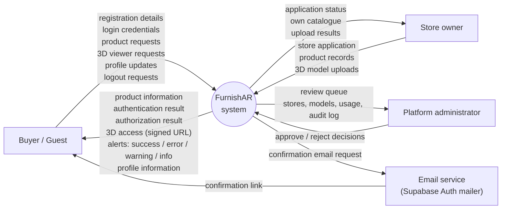

Inside the system boundary: the Next.js application on Vercel, its server
boundary (`/api/sb/*`, `lib/supabase-proxy.js`), Supabase Auth (GoTrue),
PostgREST with row-level security, Supabase Storage, and the notification
system. The secret key never reaches a browser; every data request runs as
the signed-in user, so the database's policies decide.

---

## 2. Level 1 — data flow diagram

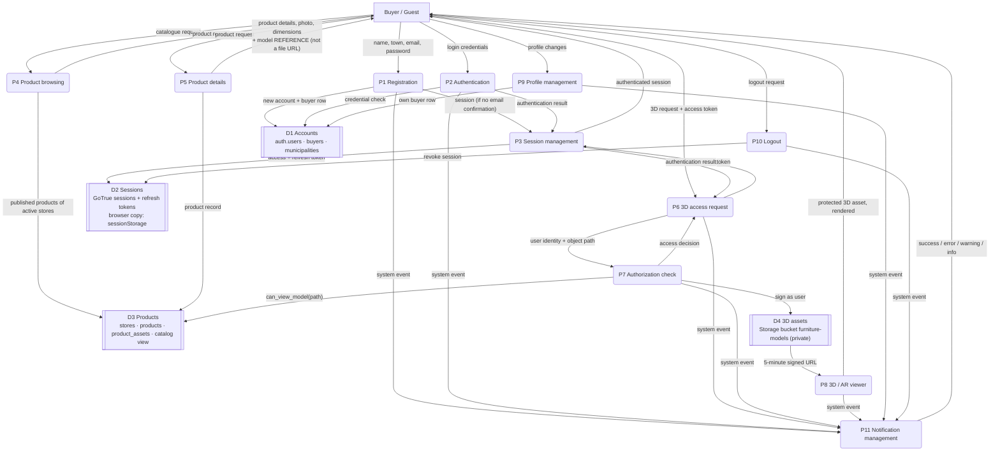

| Process | Implemented in |
|---|---|
| P1 Registration | `app/login/LoginChooser.js` (sign-up form) → `public/supabase.js` `signUpBuyer()` → `/api/sb/auth/signup` → GoTrue; trigger `create_buyer_from_signup` (0006) writes `buyers` |
| P2 Authentication | `LoginChooser.js` → `signIn()` → `/api/sb/auth/login` → GoTrue password grant |
| P3 Session management | `public/supabase.js` (`storeSession`, single-flight `refreshSession`, `getSession`, `sessionLapsed`); server-side `verifySession()` in `lib/auth.js` |
| P4 Product browsing | `/collection`, `lib/catalog.mjs` `getCatalog()` — the `catalog` view, cached 60 s and refreshed on store/admin changes; an empty database is an empty collection, a failed read says so (no bundled catalogue) |
| P5 Product details | `/furniture/[slug]` |
| P6 3D access request | `ProductActions.js`, `ProductViewer.js`, `app/plan/ar-engine.js` → `resolveModelUrl()` → `GET /api/sb/model/<path>` |
| P7 Authorization | `grantModelAccess()` in `lib/supabase-proxy.js` → Storage signs **as the user** → policy `can_view_model()` (migration 0007) |
| P8 3D / AR viewer | `ProductViewer.js` (turntable), `app/plan/ar-engine.js` (WebXR, Quick Look on iPhone) |
| P9 Profile | `/account`, `app/account/BuyerAccount.js` |
| P10 Logout | `signOut()` → `/api/sb/auth/logout` → GoTrue revokes the session |
| P11 Notifications | `lib/alerts/store.mjs`, `lib/alerts/messages.mjs`, `app/alerts/AlertContainer.js` |

The store owners' and administrators' side (applications, uploads, review)
is a separate set of processes behind their own sign-in doors (`/portal`,
`/admin`). It appears in the access matrix (§13) and route map (§14), and is
left out of this diagram so the buyer's path stays readable.

---

## 3. Authentication flow

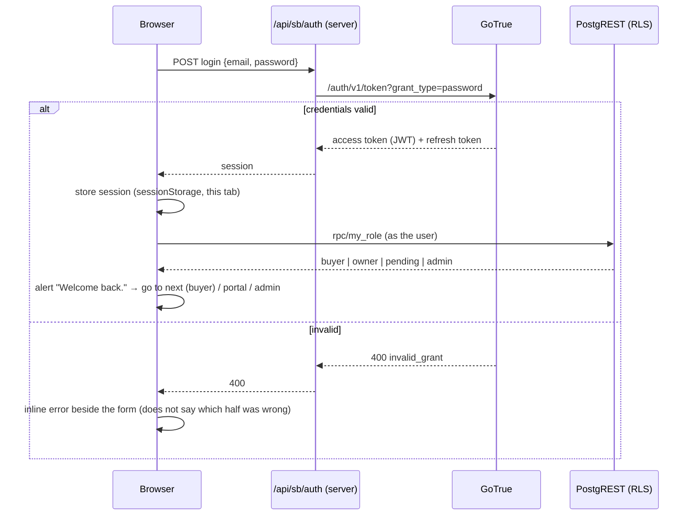

- Only the **server** talks to GoTrue with the project's key. The browser
  never holds a secret key (`assertNotSecretKey()` refuses to start with one).
- The role comes from the database (`my_role()`), not from which button was
  pressed. A store owner who clicked "I'm shopping" lands in their portal.
- A signed-in visitor who opens `/login` is forwarded to `next` rather than
  shown a form that would sign them in again as someone else.

## 4. Authorization flow

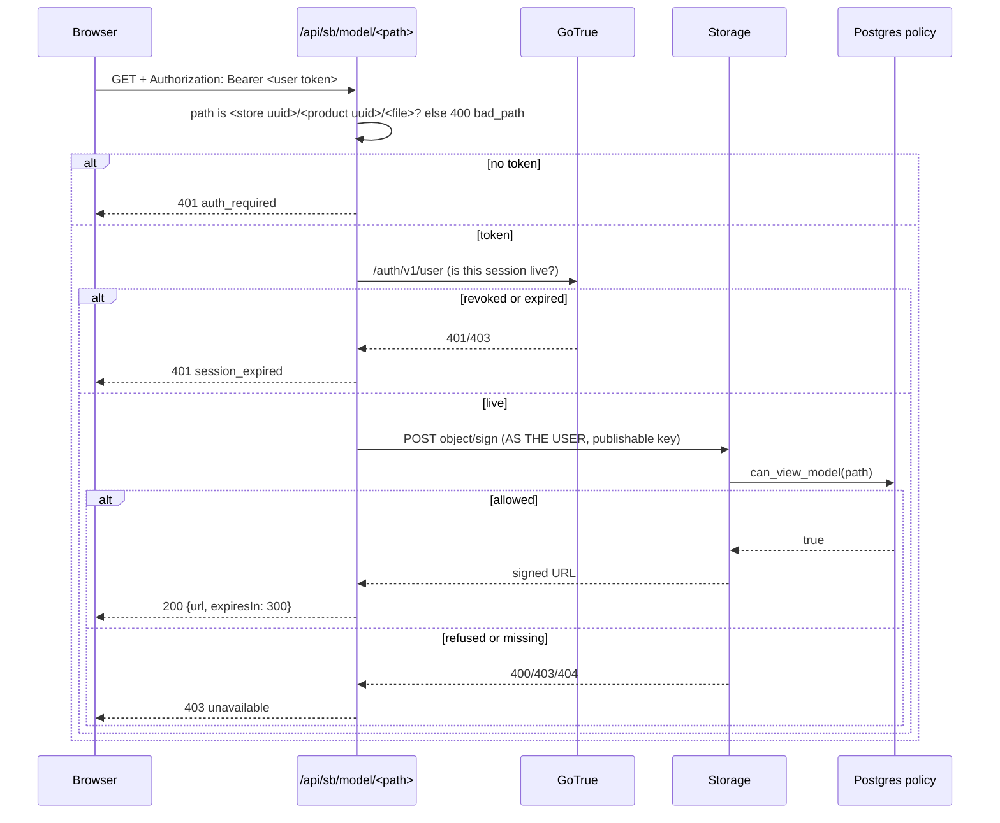

`can_view_model(path)` (migration 0007) allows:

1. a **platform admin** — everything, for the console's review of uploads;
2. a **member of the store** in the path's first folder — its own files,
   drafts included, so a shop can check an upload before publishing;
3. **anyone signed in** — the model of a *published* product of an *active*
   store, i.e. what the catalogue shows.

Signed in is necessary and not sufficient: a buyer cannot open a draft, and
one shop cannot open another's unpublished work (TEST 07).

A refused file and a missing file get the **same** answer (`403
unavailable`) on purpose: "that draft exists but is not yours" would tell a
stranger what a shop is working on. Every model response is
`Cache-Control: private, no-store`, so no shared cache ever holds a grant.

## 5. 3D file access flow — the core flow

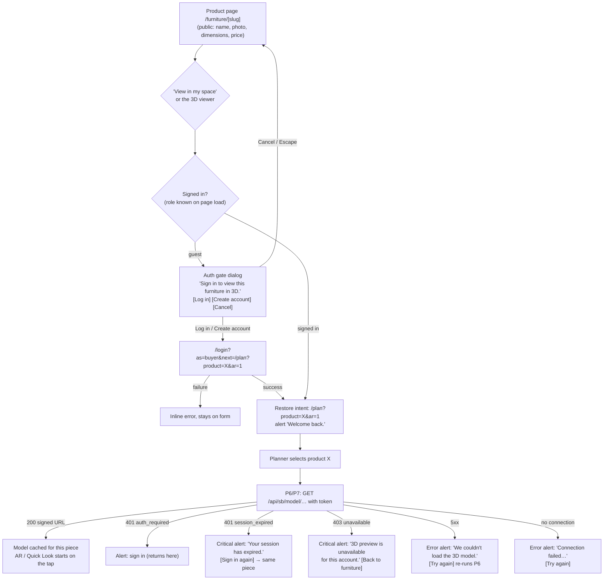

Two details matter here:

- **The model is resolved when the piece is selected, not on the AR tap.**
  WebXR and Quick Look need the browser's user-activation from the tap
  itself. A network round trip between the tap and `requestSession` would
  lose it, so the signed URL is fetched on selection and cached for its
  lifetime.
- **The product page's own viewer follows the same rule.** A guest sees
  "Sign in to view this furniture in 3D." with Log in / Create account that
  return to the piece, and no request is made at all. A signed-in buyer
  gets the real model through a signed URL.

## 6. Login flow

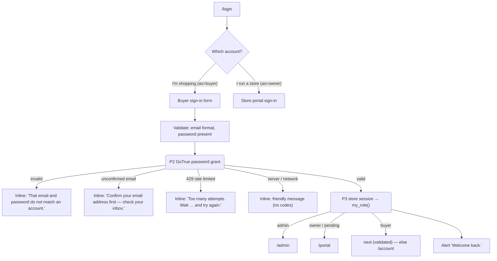

Intent is carried two ways. The first is `?next=` in the URL: the gate
dialog, the planner's sign-in panel and the viewer's Log in all put the full
address there. The second is a copy remembered for the tab
(`lib/auth-intent.js`): the planner saves it when it asks a guest to sign
in, so a sign-in reached some other way (the header's Sign in) still comes
back. The login page uses `?next=` first, then the remembered copy, and
clears the copy once used, so a later visit to `/login` cannot bounce to a
stale page. No session data is put in the URL, only the destination.

`next` is only ever a path **on this site**. `safeNext()` refuses anything
that does not start with a single `/`, and also backslashes and control
characters. A browser reads `/\evil.example` and `/<tab>/evil.example` as
`//evil.example`, so without that check a crafted sign-in link could send
someone to another site right after they typed their password (checked in
`check:access`).

## 7. Signup flow

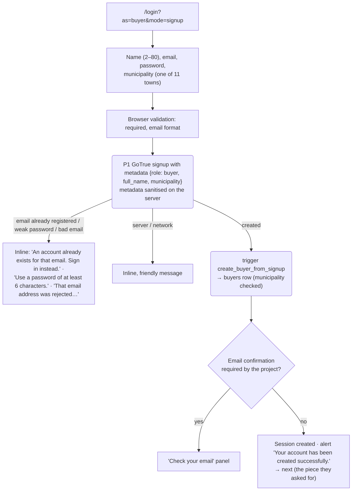

Password strength rules are the Supabase project's (Auth settings). There
is no "confirm password" field: the show-password toggle does that job
without asking for the password twice. **Known limitation:** when email
confirmation is on, the link in the email goes to the project's site URL,
so the account is created but the `next` intent is not carried through the
email.

## 8. Logout flow

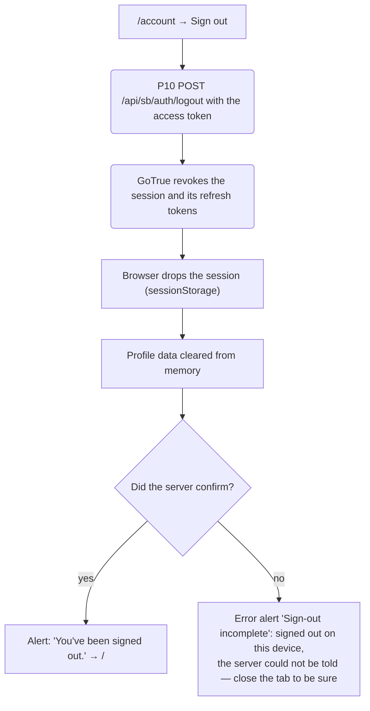

After logout the old token is refused by the 3D endpoint at once
(`401 session_expired`, TEST 11), because that endpoint asks GoTrue whether
the session still exists rather than only checking the token's signature.
**Limitation, stated plainly:** an access token is a signed JWT, and
PostgREST accepts one until it expires (at most an hour) without asking
GoTrue. What such a token can read through PostgREST is limited by RLS to
public data and the account's own rows. The one protected resource, the 3D
files, is behind the GoTrue check.

## 9. Profile flow

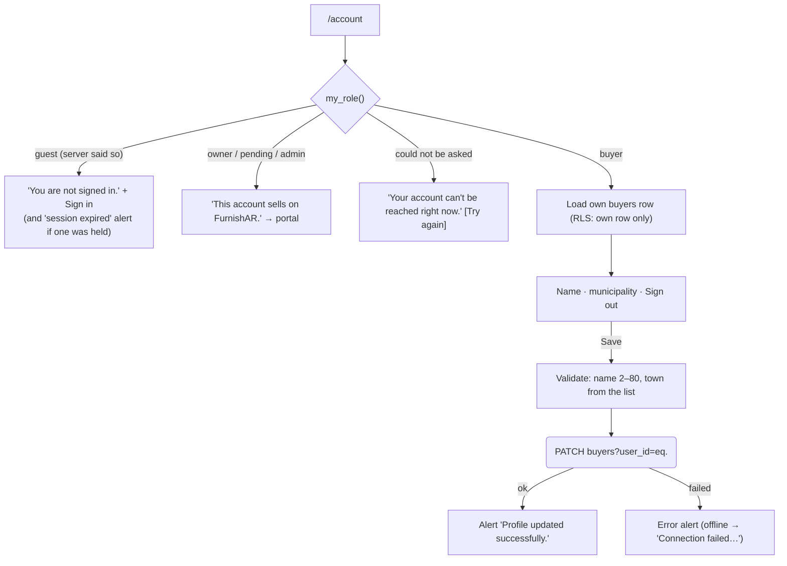

What exists: name, municipality, sign out. What does **not** exist, and is
therefore not drawn: saved rooms, saved furniture, recent activity. The
planner's room scan lives in the page while it is open and is not stored.

## 10. Notification flow

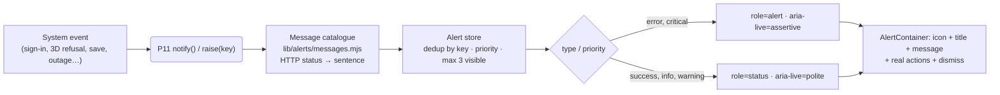

- **One system.** React pages use `useAlert()`. The vanilla AR engine
  imports the same store, so the planner's messages come from the same
  queue, not a second toast system. `lib/flash.js` (`flashSuccess`,
  `flashError`, `flashInfo`) is the variant that survives a full page load:
  it stores the message for the tab, and `app/FlashBanner.js` hands it to
  the same store on the next page.
- **Four types** (success, info, warning, error), each with an icon and a
  title, so meaning never depends on colour alone. **Critical** alerts stay
  until dismissed. The others time out (4–9 s) and pause while hovered or
  focused.
- **The same event raised twice updates one alert** instead of stacking a
  duplicate. `update()` rewrites an alert in place, so a retry replaces
  "failed" with "ready" rather than showing both.
- **Actions do something real:** a sign-in that returns to the same piece,
  or a retry that re-runs the request. An action with neither a link nor a
  handler is dropped rather than rendered as a dead button.
- **No fake success.** Success is raised only after the server confirmed
  the change.
- **Inline versus alert.** A failure that belongs to a form (wrong
  password) stays beside the form. An event that outlives the page (signed
  in, signed out) or has no form (3D refused) goes to the alert system.
  One event, one message.
- Alerts are **not stored**. There is no notifications table; an alert
  belongs to the tab that saw the event.

## 11. Error flow

| Process | Success | Failure states and what the person sees |
|---|---|---|
| Registration | account created (and signed in, or "check your email") | duplicate email, weak password, rejected email, missing field (browser), rate limit, server/network: inline, in words |
| Login | "Welcome back." → intent restored | wrong credentials (does not say which half), unconfirmed email, rate limit, server/network: inline |
| 3D access | model opens | not signed in → gate / sign-in alert · expired → critical "session has expired" · refused → critical "unavailable for this account" · server 5xx → "couldn't load" + Try again · offline → "Connection failed" + Try again · no model uploaded → says so, not "failed" · corrupt or HTML file → names the real cause |
| Profile | "Profile updated successfully." | load failure → "can't be reached" + Try again · save failure → error alert, form keeps its values |
| Logout | "You've been signed out." | server not told → "Sign-out incomplete": signed out on this device only |
| Database | normal | configured but not answering → planner and account show "can't reach the server" with Try again; **the session is kept**, and it is never called an expiry · the collection says it couldn't be loaded (never demo furniture) |
| Network | normal | "Connection failed. Check your internet connection and try again." + Try again |
| Authentication | valid | invalid → sign-in · expired → "session has expired" + sign in again to the same place |

No message shows a status code, stack trace, storage path or database
identifier. The detail goes to the server log (`console.warn` in
`grantModelAccess`) and the browser console.

## 12. Session state flow

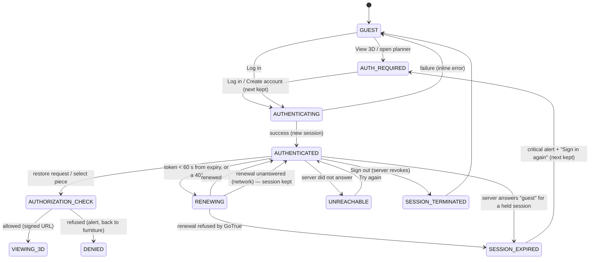

Three distinctions the code keeps:

- **Expired vs first visit.** A session held and refused, or one whose
  renewal GoTrue refused, is "expired" (`sessionExpiry.js`,
  `sessionLapsed()`). A visitor with no session is simply a guest.
- **Expired vs outage.** A question the server did not answer is not an
  answer. `myRole()` returns `guest` only when the server *refused* the
  token (401/403). An unanswered question throws `unreachable`, and callers
  show a retry and keep the sign-in. A network failure during renewal also
  keeps the session.
- **Renewal happens once.** Refresh tokens rotate, so concurrent 401s
  share a single refresh (`refreshSession()`) instead of racing to spend
  the same token.

The session is stored per tab (`sessionStorage`). Closing the tab ends it
on that device.

## 13. Access-control matrix

✓ allowed · ✕ refused · — not applicable. "Enforced by" names the layer
that actually refuses. A UI gate is listed only where it is the courtesy in
front of a server rule.

| Resource / action | Guest | Buyer | Applicant (pending) | Store owner | Admin | Enforced by |
|---|---|---|---|---|---|---|
| Home, catalogue, FAQ | ✓ | ✓ | ✓ | ✓ | ✓ | public |
| Product details, photo, thumbnail, dimensions, price, store | ✓ | ✓ | ✓ | ✓ | ✓ | public (`catalog` view: published + active only) |
| Home-page living-room scene | ✓ | ✓ | ✓ | ✓ | ✓ | public: site decoration, not a store's product |
| **3D model of a published product** | ✕ | ✓ | ✓ | ✓ | ✓ | `/api/sb/model` (GoTrue) + Storage policy `can_view_model` |
| **3D model of a draft / hidden product** | ✕ | ✕ | ✕ | own store only | ✓ | Storage policy `can_view_model` |
| Planner `/plan` (measure, place) | ✕ gate | ✓ | ✓ | ✓ | ✓ | UI gate (`PlannerGate`); the models inside it are server-protected |
| AR placement / Quick Look | ✕ | ✓* | ✓* | ✓* | ✓* | same as the model: needs the signed URL |
| Buyer profile `/account` (read, edit) | ✕ | own row | — | — | — | RLS on `buyers` (own row only) |
| Sign out | — | ✓ | ✓ | ✓ | ✓ | GoTrue revocation |
| Store portal `/portal`: own products, uploads | ✕ | ✕ | application status | own store | — | RLS via `store_members` |
| Upload a model | ✕ | ✕ | ✕ | own store folder | — | upload signing + Storage policy |
| Admin console `/admin`: queue, stores, models, usage, audit | ✕ | ✕ | ✕ | ✕ | ✓ | RLS + `is_platform_admin()` |
| Approve / reject a store | ✕ | ✕ | ✕ | ✕ | ✓ | security-definer functions check `is_platform_admin()` |

\* Only for a model the policy allows, per the two model rows above.
Authenticated never means "everything".

## 14. Route / screen map

| Route | Kind | Who | Notes |
|---|---|---|---|
| `/` | static | everyone | hero scene, featured pieces |
| `/collection` | server-rendered, 60 s cache | everyone | filters and search; cards show posters, never models; empty state when nothing is listed |
| `/furniture/[slug]` | pre-rendered + ISR | everyone | details are public; the 3D viewer and "View in my space" need sign-in |
| `/faq`, `/diagnose` | static | everyone | `/diagnose` checks the device's AR support |
| `/login?as=buyer\|owner&next=…&mode=signup` | client | everyone | role chooser; `next` restores intent; `mode=signup` opens the create tab |
| `/plan?product=…&ar=1` | client, gated | signed-in accounts | `PlannerGate`: guest → sign-in panel (keeps the full URL as `next`); outage → retry panel |
| `/account` | client | buyers | profile and sign out |
| `/portal` | client | store owners / applicants | own catalogue, uploads |
| `/admin`, `/admin/{applications,stores,models,usage,activity}` | client | platform admins | one gate for all six pages |
| `GET /api/sb/status?probe=1` | API | everyone | is a database configured and answering? |
| `/api/sb/rest/<table or rpc/fn>` | API | as the caller | allow-listed tables and functions only; the caller's token is forwarded, RLS decides |
| `POST /api/sb/auth/{login,signup,refresh,logout,resend}` | API | as the caller | signup metadata sanitised on the server |
| `GET /api/sb/model/<store>/<product>/<file>` | API | signed-in, authorized | the only way to a product model; `private, no-store` |
| `POST /api/sb/storage/sign` | API | store members | signed upload URLs |
| `POST /api/sb/models/poster\|revalidate\|admin-cleanup` | API | store owner / admin | catalogue posters, catalogue refresh, 365-day model cleanup (0012) |
| `GET /api/cron/model-notices` | API (scheduler, `CRON_SECRET`) | — | emails owners 30 days before a model can be deleted; cleanup needs that notice (0013) |
| `/api/sb/rest/rpc/store_model_lifecycle`, `keep_model` | API | store owner | the shop's own model lifecycle; "Keep 3D model" (0013) |

## 15. Database / data-store map

| Store | Holds | Exists as |
|---|---|---|
| D1 Accounts | identities; buyer name and town; the 11 municipalities | `auth.users` (GoTrue), `public.buyers`, `public.municipalities` |
| D2 Sessions | live sessions, rotating refresh tokens; a copy for this tab | GoTrue's session tables; browser `sessionStorage['furnishar-sb-session']` |
| D3 Products | shops, products, which file belongs to which product | `public.stores`, `public.products`, `public.product_assets`, view `public.catalog` |
| D4 3D assets | `.glb` / `.usdz` files at `<store>/<product>/<file>` | Storage bucket `furniture-models`, **private** after 0007 |
| D5 Roles and applications | who runs which shop, pending applications, administrators | `public.store_members`, `public.store_applications`, `public.platform_admins` |
| D6 Audit | every admin approval and rejection | `public.admin_audit` |
| — Notifications | not stored: per-tab, in memory | `lib/alerts/store.mjs` |
| — Saved rooms | **does not exist** | — |

What each process reads, creates, updates and deletes:

| Process | Reads | Creates | Updates | Deletes |
|---|---|---|---|---|
| P1 Registration | D1 municipalities | D1 user + buyer row, D2 session | — | — |
| P2 Authentication | D1 | D2 session | — | — |
| P3 Session | D2 | — | D2 (rotates refresh token) | D2 (on refused renewal: browser copy) |
| P4/P5 Browsing, details | D3 `catalog` | — | — | — |
| P6/P7 3D access | D2 (session live?), D3 `product_assets`/`products`/`stores`, D5 `store_members`/`platform_admins` | a signed URL (not stored) | — | — |
| P8 Viewer | D4 via signed URL | — | — | — |
| P9 Profile | D1 own buyer row, municipalities | — | D1 own buyer row | — |
| P10 Logout | — | — | — | D2 session (server), browser copy |
| P11 Notifications | — | in-memory alerts | in-memory alerts | in-memory alerts |
| Store portal | D3 own rows | D3 products, D4 files | D3 own rows | D3 own rows, D4 own files |
| Admin console | D3, D4 listing, D5, D6 | D5 membership, D6 audit entry | D3 store status, D5 application status | — |

## 16. Complete user journey

1. **Maria** opens FurnishAR from a shared link. She is a guest.
2. She browses `/collection`, filters by *Chair*, and opens an
   **armchair**. Name, photo, dimensions, price and the shop are all there
   with no account. The viewer says "Sign in to view this furniture in 3D."
3. She taps **View in my space**. The page does not navigate. A dialog
   says what happened, why, and what she can do: Log in · Create account ·
   Cancel. Focus is on the dialog's heading; Escape returns her to the button.
4. She chooses **Create account**. `/login` opens on the create tab with
   `next=/plan?product=cane-armchair&ar=1`. She enters her name, email,
   password and town (Mamburao).
5. The account is created and she is signed in: "Your account has been
   created successfully." She lands in the planner **with the armchair
   already selected**, not on the home page.
6. The planner asks the server for the armchair's model: session live, a
   published piece of an active shop, so it is allowed. A five-minute URL is
   fetched **before** she taps.
7. She taps to place it. AR starts on that tap, and she walks around the
   armchair in her room at its real size.
8. Later she signs out on her laptop, which ends her sessions everywhere.
   Back in the phone tab, which still holds the old session, the planner
   says "Your session has expired. Please sign in again." Sign in again
   brings her back to the same piece. (A session is kept per tab, so a new
   tab simply starts as a guest.)
9. From **Account** she changes her town, and sees "Profile updated
   successfully." She signs out: "You've been signed out." Her old token no
   longer opens any model.

**Branches.** A wrong password stays on the form, in words. A shop's draft
she somehow has a link to: "3D preview is unavailable for this account."
Wi-Fi drops: "Connection failed…" with Try again. The database is down:
"The planner can't reach the server." with Try again, and she stays signed in.

## 17. Test cases

`check:access` is `scripts/check-access.mjs`: a real browser against a
fake Supabase that enforces what migration 0007 enforces. Unit tests are
`npm test`.

| # | Case | Expected | Verified by | Result |
|---|---|---|---|---|
| 01 | Guest opens product | details load; no model URL in the page; viewer asks for sign-in and makes no request | check:access | pass |
| 02 | Guest clicks View 3D | gate dialog, focus on heading, Escape closes, focus returns | check:access | pass |
| 03 | Guest clicks Log in | login page carrying `next` = this piece | check:access | pass |
| 04 | Invalid login | error beside the form, does not say which half | check:access | pass |
| 05 | Valid login | session created; "Welcome back." | check:access | pass |
| 06 | Valid login after asking for 3D | lands on `/plan?product=cane-armchair&ar=1` | check:access | pass |
| 07 | Signed-in user, unauthorized model | `403 unavailable`, no storage detail leaked | check:access, tests/model-access.test.js | pass |
| 08 | Authorized user | signed URL downloads; product viewer turns the real model | check:access, tests/model-access.test.js | pass |
| 09 | Session expires | critical "session has expired", Sign in again keeps the piece — both when the server answers "guest" and when renewal is refused | check:access | pass |
| 10 | Logout | confirmed; session revoked on the server | check:access | pass |
| 11 | Protected access after logout | old token → `401 session_expired` | check:access | pass |
| 12 | 3D server fails | "couldn't load the 3D model" + Try again that re-runs and replaces the failure | check:access | pass |
| 13 | Database unavailable | "can't reach the server" + Try again; not called an expiry; sign-in kept; recovers | check:access | pass |
| 14 | Network failure | "Connection failed…" | check:access | pass |
| — | `next` open-redirect attempts (`/\`, `/<tab>/`, `//`, absolute) | stay on the site | check:access | pass |
| — | Two live regions; dismiss; 320 px fit; 44 px targets | as specified | check:access | pass |
| — | Alert store: dedup, priority, sticky critical, update in place, no empty messages, status mapping | as specified | tests/alerts.test.js (14) | pass |
| — | Every AR model failure names its real cause | as specified | check:ar | pass |

## 18. Missing logic identified from the original diagram

Read against the concepts the brief lists for the diagram. The image itself
was not available, so treat B–D as questions to check against it rather
than as findings about lines I could see.

**A. Already right**
- 3D is the protected thing, and login/signup comes before it.
- Login and signup have success **and** failure outcomes, each with a message.
- Profile leads to logout.
- Alerts are treated as states of the system, not decoration.

**B. Ambiguous**
- *When* is sign-in required: on entering the site, the product page, or
  the 3D action? Resolved: on the **action**; browsing stays public.
- *Whose* dashboard? FurnishAR has no buyer dashboard. The store portal
  and admin console are separate roles behind separate doors. A buyer's
  post-login destination is the task they started (`next`), else `/account`.
- *Which* alert is each "alert message" box: type, wording, what it lets
  the person do?
- "Buyer access" mixes two questions: is this a buyer (authentication) and
  may this buyer open this file (authorization).

**C. Missing**
- The **authorization** step between "logged in" and "3D file".
- **Return to intent** after login/signup.
- **Session expiry** and **renewal**, and telling expiry apart from a first
  visit and from an outage.
- **Server-side** logout (revocation), not only the UI state changing.
- **Failure paths:** access denied, 3D server down, database down, network down.
- The **store owner** and **administrator** roles and their own sign-in doors.
- The **email-confirmation** branch of signup, and rate limiting.
- The **data stores** (accounts, sessions, products, private 3D assets).

**D. Technically incorrect (if drawn this way)**
- "Login success → 3D file" as a direct arrow: success is authentication,
  not permission to a particular file.
- "Logout → public screen" as the whole of logout: the session has to die
  on the server.
- "Login → Home/Dashboard": this drops what the person was doing.
- Alert boxes attached to single screens: the same event raised from two
  places would say two different things.

**E. Add**
- P7 authorization with its decision, D4 as a *private* store, and signed,
  short-lived URLs as the only way from D4 to the viewer.
- P3 session management, including renewal, expiry and revocation.
- P11 as one notification process that every other process sends events to.
- An error sink for every process (§11).

**F. Remove**
- Any path from the UI to a 3D file that does not pass P7.
- Per-screen alert variants, replaced by the one catalogue.
- Arrows with no data meaning ("next", "go"), relabelled with what flows.

**G. Move from UI flow into backend/system logic**
- "Can this person see the 3D model?": was a hidden button; now the model
  endpoint plus the Storage policy.
- "Is this session still valid?": asked of GoTrue by the server, not
  inferred from a flag in the browser.
- "What role is this account?": `my_role()` in the database, not the
  button that was pressed.
- Logout: server revocation.

**H. Keep purely as UI behaviour**
- The sign-in gate dialog and the planner's sign-in panel (courtesies in
  front of a server rule).
- Carrying `next` through login, and opening the create-account tab.
- Showing, pausing and dismissing alerts; focus management; Try again buttons.
- Measuring a room without a model (it reads no protected resource).

---

## Operational notes

- **Migration 0007 must be applied to the production database.** Until it
  is, the model endpoint still requires sign-in and the app no longer
  publishes model URLs. But the bucket itself is still public, and every
  signed-in account can sign drafts. The file path appears in the model
  reference, so a file is only as hidden as the project URL. Apply 0006
  and 0007 in order.
- The service-role / `sb_secret_` key is never used to serve a browser
  request. Every read and every signed URL is made as the user, so the
  database's policies are the authority.
- Checks: `npm test`, `npm run check:access`, `npm run check:ar`.
